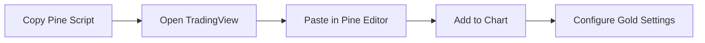
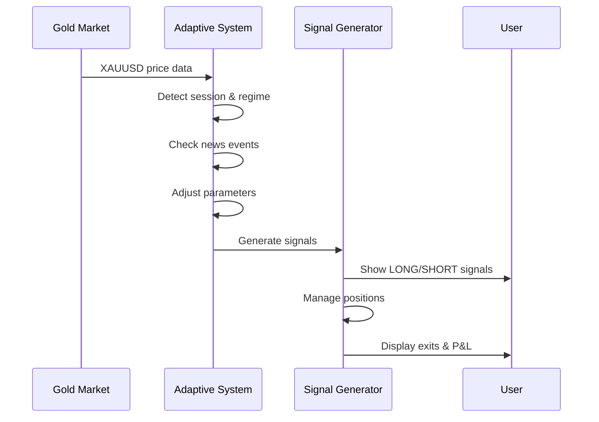
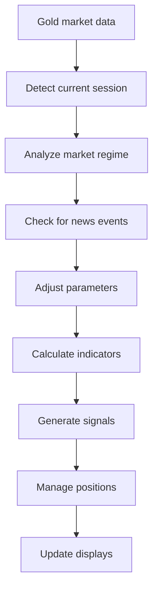

# Forexoid XAUUSD Adaptive v1.0 - TradingView Pine Script v6

<div align="center">


*"Advanced adaptive trading system specifically optimized for XAUUSD (Gold) with dynamic market regime detection!"*

</div>

## Description

Forexoid XAUUSD Adaptive v1.0 is a sophisticated TradingView Pine Script indicator designed exclusively for XAUUSD (Gold) trading. It features adaptive parameter adjustment, session-based optimization, market regime detection, news event filtering, multi-timeframe analysis, and intelligent risk management specifically calibrated for gold's unique market characteristics.

> **Why did I create this?** Because gold trading requires specialized parameters and adaptive systems that differ significantly from forex pairs!

## Features

| Feature | Description |
|---------|-------------|
| **Adaptive System** | Parameters adjust automatically based on market conditions |
| **Session-Based Optimization** | Different strategies for Asian/European/American/Overlap sessions |
| **Market Regime Detection** | TRENDING/RANGING/BREAKOUT/NEUTRAL market analysis |
| **News Event Filter** | Automatic detection and protection during high volatility |
| **Multi-Timeframe Analysis** | H1 trend + M15 structure + M5 execution confluence |
| **RSI Integration** | Advanced RSI filtering for entries and exits |
| **Bollinger Bands Integration** | Volatility analysis and extreme value detection |
| **Risk Management** | Gold-specific risk parameters and position sizing |

### What exactly does it do?

```
Gold Market Analysis: Session + Regime + News + Volatility
     ↓ [Adaptive Parameter Adjustment]
Signal Generation: LONG/SHORT with strength scoring (5.5-8.0+)
     ↓ [Multi-Timeframe Confluence]
Position Management: Dynamic stops, trailing stops, profit targets
     ↓ [Result]
Professional gold trading system with adaptive intelligence!
```

## Visual Preview

<div align="center">

### Forexoid XAUUSD Adaptive in Action


*Professional gold trading signals with adaptive parameters*

</div>

## Installation

<div align="center">

### Quick start (3 steps!)

</div>



**Detailed steps:**

1. **Copy** the Pine Script code from `Forexoid_XAUUSD_Adaptive.pine`
2. **Open** TradingView and go to Pine Editor
3. **Paste** the code into the editor
4. **Click** "Add to Chart"
5. **Configure** settings for XAUUSD trading

> **Tip:** The indicator works best as an overlay on XAUUSD M5 charts!

## Configuration

### XAUUSD Specific Settings

| Parameter | Default value | Description | Tip |
|-----------|---------------|-------------|-----|
| `Enable Session Optimization` | `true` | Auto-adjust for trading sessions | Essential for gold |
| `Enable News Filter` | `true` | Filter signals during news events | Critical for gold |
| `Enable Volatility Filter` | `true` | Filter based on volatility | Gold-specific |
| `Enable Multi-Timeframe` | `true` | Use H1/M15/M5 confluence | Recommended |

### Adaptive Parameters (Gold Optimized)

| Parameter | Default value | Description | Tip |
|-----------|---------------|-------------|-----|
| `Enable Adaptive System` | `true` | Auto-adjust parameters | Core feature |
| `High Volatility Threshold` | `2.0` | High volatility detection | Gold-specific |
| `Low Volatility Threshold` | `1.0` | Low volatility detection | Gold-specific |
| `High Volume Threshold` | `2.5` | High volume detection | Higher than forex |
| `Low Volume Threshold` | `0.8` | Low volume detection | Gold-specific |

### Risk Management (Gold Optimized)

| Parameter | Default value | Description | Tip |
|-----------|---------------|-------------|-----|
| `Max Risk Per Trade (%)` | `1.5` | Maximum risk per trade | Lower than forex |
| `ATR Multiplier for Stops` | `2.2` | Stop loss multiplier | Higher than forex |
| `Profit Target Ratio` | `2.5` | Risk/reward ratio | Gold-optimized |
| `Enable Trailing Stop` | `true` | Dynamic trailing stops | Recommended |
| `Trailing Stop ATR Multiplier` | `1.5` | Trailing stop sensitivity | Gold-specific |

### Visual Settings

| Parameter | Default value | Description | Tip |
|-----------|---------------|-------------|-----|
| `Show Trend Line` | `true` | Display adaptive trend line | Essential |
| `Show S/R Levels` | `true` | Show support/resistance | Helpful |
| `Signal Size` | `Medium` | Label size | Adjust to preference |

> **Recommendation:** Start with default settings optimized for XAUUSD M5 timeframe!

## Usage

<div align="center">

### Gold trading workflow

</div>



**Step by step:**

1. **Add** Forexoid XAUUSD Adaptive to your XAUUSD chart
2. **Watch** for 🥇 LONG/SHORT signals with session info
3. **Observe** adaptive parameter changes in real-time
4. **Check** the information table for market analysis
5. **Monitor** news event warnings (🚨)
6. **Use** multi-timeframe confluence for confirmation

> **Pro tip:** Gold signals adapt automatically to current session and market regime!

## Technical Details

### How it works



### Signal Logic

| Signal | Condition | Action |
|--------|-----------|--------|
| **🥇 LONG** | Score ≥ threshold + session optimized + regime confirmed | Green label with gold theme |
| **🥇 SHORT** | Score ≥ threshold + session optimized + regime confirmed | Red label with gold theme |
| **🔴/🟢 EXIT** | Stop loss/Take profit/Structure change/Momentum/News/RSI | Orange exit label with P&L |

### Adaptive Parameter System

| Session | Trend Sens | Momentum Sens | Profit Target | Risk % | Threshold |
|---------|------------|---------------|---------------|--------|-----------|
| **ASIAN** | 0.4 | 0.5 | 1:2.0 | 1.0% | 7.0 |
| **EUROPEAN** | 0.3 | 0.4 | 1:2.5 | 1.5% | 6.5 |
| **AMERICAN** | 0.2 | 0.3 | 1:3.0 | 2.0% | 6.0 |
| **OVERLAP** | 0.1 | 0.2 | 1:4.0 | 2.5% | 5.5 |

### Market Regime Detection

| Regime | Characteristics | Strategy Adjustment |
|--------|-----------------|-------------------|
| **TRENDING** | Strong directional movement | Trend following parameters |
| **RANGING** | Sideways movement | Mean reversion parameters |
| **BREAKOUT** | High volatility breakouts | Breakout parameters |
| **NEUTRAL** | Unclear direction | Default parameters |

### Signal Strength Calculation

| Component | Weight | Purpose |
|-----------|--------|---------|
| **Trend H1** | 2.5 | Primary trend direction |
| **Momentum** | 2.0 | Price momentum |
| **Structure** | 1.5 | Market structure |
| **Volume** | 1.0 | Volume confirmation |
| **VWAP** | 1.0 | Price vs VWAP |
| **Volatility** | 1.0 | Volatility context |
| **Multi-TF** | 1.0 | Timeframe confluence |
| **News Filter** | 0.5 | News event protection |
| **RSI Filter** | 0.5 | RSI extreme protection |
| **BB Filter** | 0.5 | Bollinger Bands protection |

### News Event Detection

- **Volatility Spike**: ATR ratio > 3.0 (higher than forex)
- **Volume Spike**: Volume > 4.0x average (higher than forex)
- **Price Spike**: Price change > 0.5% (higher than forex)
- **Protection**: Automatic signal filtering during news

## Multi-Timeframe Analysis

The indicator analyzes gold trends across multiple timeframes:

| Timeframe | Purpose | Analysis Method |
|-----------|---------|-----------------|
| **H1** | Primary trend | EMA + Momentum analysis |
| **M15** | Structure confirmation | SMA-based trend detection |
| **M5** | Execution signals | Full adaptive analysis |

## Session-Based Optimization

### Asian Session (00:00-08:00 UTC)
- **Strategy**: Scalping
- **Characteristics**: Lower volatility, ranging movements
- **Parameters**: Higher sensitivity, smaller targets

### European Session (08:00-13:00 UTC)
- **Strategy**: Trend Following
- **Characteristics**: Medium volatility, trend movements
- **Parameters**: Balanced sensitivity, medium targets

### American Session (16:00-21:00 UTC)
- **Strategy**: Breakout Trading
- **Characteristics**: Highest volatility, breakout movements
- **Parameters**: Lower sensitivity, larger targets

### Overlap Session (13:00-16:00 UTC)
- **Strategy**: News Trading
- **Characteristics**: Extreme volatility, news-driven movements
- **Parameters**: Lowest sensitivity, largest targets

## Alerts

Built-in alerts for:
- **🥇 LONG Alert**: "XAUUSD LONG signal detected"
- **🥇 SHORT Alert**: "XAUUSD SHORT signal detected"
- **🔴/🟢 EXIT Alert**: "XAUUSD position closed"
- **🚨 News Alert**: "High volatility detected"

## Gold-Specific Characteristics

### XAUUSD vs Forex Differences

| Characteristic | Forex | XAUUSD |
|----------------|-------|--------|
| **Volatility** | Medium | High |
| **Spread** | 0.5-2 pips | 2-5 USD |
| **News Sensitivity** | High | Extremely High |
| **Stop Loss** | 1.5x ATR | 2.2x ATR |
| **Risk per Trade** | 2.0% | 1.5% |
| **Signal Threshold** | 6.0 | 6.5 |

### Important Gold Factors

1. **USD Correlation**: Strong negative correlation with USD
2. **Inflation Hedge**: Reacts to inflation data
3. **Geopolitical**: Safe haven asset
4. **Interest Rates**: Sensitive to rate changes
5. **Economic Data**: Highly reactive to economic news

## Warnings

<div align="center">

### Important information before use!

</div>

| Warning | Description | Reason |
|---------|-------------|--------|
| **Gold Volatility** | Higher volatility than forex pairs | Requires larger stop losses |
| **News Sensitivity** | Extremely sensitive to news events | May cause rapid price movements |
| **Session Differences** | Different characteristics per session | Parameters adapt automatically |
| **Risk Management** | Use appropriate position sizing | Gold requires careful risk management |
| **Demo Testing** | Always test on demo first | Gold trading has unique characteristics |

> **Golden rule:** "Gold trading requires specialized risk management and adaptive systems!"

## Performance Expectations

### Target Metrics

| Metric | Target Value | Advantage |
|--------|--------------|-----------|
| **Win Rate** | 65-75% | Adaptive parameters |
| **Risk/Reward** | 1:2.5 | Session optimization |
| **Max Drawdown** | <12% | News filter protection |
| **Sharpe Ratio** | >1.8 | Multi-timeframe confluence |
| **Signals per Day** | 2-6 | Gold-specific filtering |

## Changelog

### Version 1.0 - "Gold Market Specialist"

| Feature | Status | Description |
|---------|--------|-------------|
| Adaptive System | ✅ | Auto-adjusting parameters for gold |
| Session Optimization | ✅ | Asian/European/American/Overlap strategies |
| Market Regime Detection | ✅ | TRENDING/RANGING/BREAKOUT/NEUTRAL |
| News Event Filter | ✅ | Automatic volatility protection |
| Multi-Timeframe Analysis | ✅ | H1/M15/M5 confluence |
| RSI Integration | ✅ | Advanced RSI filtering |
| Bollinger Bands Integration | ✅ | Volatility analysis |
| Risk Management | ✅ | Gold-specific risk parameters |

> **Version 1.0 features:** Complete gold trading system with adaptive intelligence, session-based optimization, market regime detection, and comprehensive risk management!

## License

<div align="center">

### 📜 MIT License

**Free to use for commercial and non-commercial purposes!**

[](https://opensource.org/licenses/MIT)

</div>

This project is licensed under the MIT License - see the [LICENSE](LICENSE) file for details.

## Author

<div align="center">

### 👨‍💻 Forexoid Developer

**Created with 🥇 gold trading expertise**

[](https://www.tradingview.com/)

</div>

| Contact | Link |
|---------|------|
| **TradingView** | [Forexoid Indicators](https://www.tradingview.com/) |
| **Support** | I welcome feedback and suggestions! |

## Support

<div align="center">

### Need help with gold trading?

</div>


**How to get help:**

1. **Read** the `XAUUSD_Indicator_User_Guide.md` for detailed instructions
2. **Check** the `XAUUSD_Specialized_Indicator_Functionality.md` for technical details
3. **Test** on demo account before live trading
4. **Monitor** performance and adjust parameters as needed

---

<div align="center">

### If you like this gold indicator...

**Don't forget to give it a star!** ⭐

*Every star motivates further gold trading development!*

</div>
